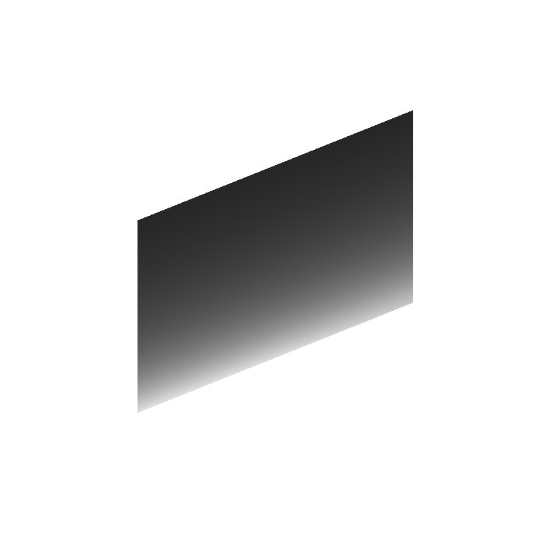
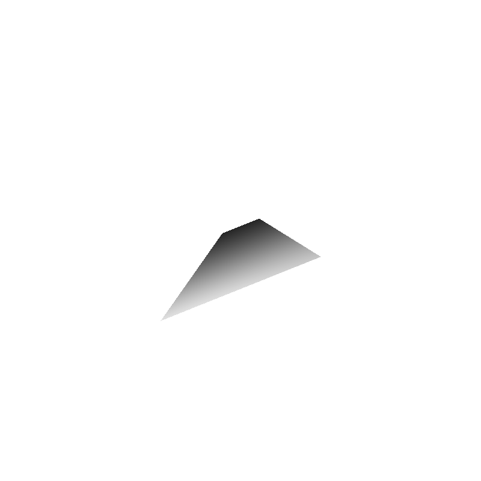
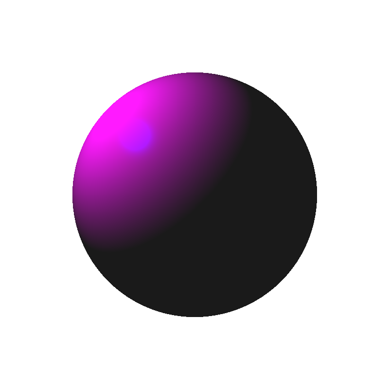

Introduction to Raytracing and Shading
======================================

This assignment aims to implement your first ray tracer and get familiar with different shading.
In the first exercise, you will implement a raytracer to render spheres and planes with different projections.
In the second exercise, you will extend the ray tracer to support different shading.

### Using Eigen

You will need to do operations with vectors and matrices in all exercises. To simplify the code, you will use [Eigen](http://eigen.tuxfamily.org/).
Have a look at the [Getting Started](http://eigen.tuxfamily.org/dox/GettingStarted.html) page of Eigen as well as the [Quick Reference](http://eigen.tuxfamily.org/dox/group__QuickRefPage.html) page for a reference of the basic matrix operations supported.

### Preparing the Environment and Submission

Follow the instructions on the [general instructions page](../Rules.md) to set up what you need for the assignment.

Ex.1: Basic Ray Tracing [16pt]
-----------------------

### Description

In this exercise, you will modify the provided code to launch primary rays from the camera following a perspective projection model and implement the intersection with a parallelogram.

### Tasks

Each `TODO` in the provided code corresponds to a part that you need to fill to complete the assignment.

#### Ray Tracing a Parallelogram [8pt]

1. Set up the parameters of the parallelogram (position of the corner, plus one vector for each side of the parallelogram)
2. Create a function to check if a ray intersects with an arbitrary parallelogram.
3. Calculate the intersection between the ray and the parallelogram using the function defined above.
4. Compute the normal of that intersection point.


#### Ray Tracing with Perspective Projection [8pt]

5. Modify the ray-sphere intersection to follow the generic case we saw in class.
6. Modify the ray equation for perspective projection.
7. Compare the difference in the result for a sphere for a parallelogram (you can also create a scene with multiple objects).


Ex.2: Shading [10pt]
-------------

### Description

In this second exercise, you will implement the shading equations introduced in class.

### Tasks

1. Implement the basic shading components discussed in class: ambient, specular, and diffuse.
2. Add RGB components instead of the current grey-scale one.
3. Experiment with the different parameters and observe their effect on the ray-traced shapes.


Starting Code
-------------

After compiling the code following the process described in the [general instructions page](../Rules.md), you can launch the program from the command-line as follows:

```
mkdir build; cd build; cmake ..; make
./assignment2
```

Once you complete the assignment, you should see the result pictures generated in your folder.

If you run the code provided in this assignment, it should produce the following image in your current working directory:


Tip: if you are using VSCode you can open the png in a tab, and it will automatically refresh every time the png is updated.


Sample output
-------------

Using the provided parameters, the parallelogram with orthographic projection should look like this


Using the provided parameters, the parallelogram with perspective projection should look like this


Using the provided parameters, the sphere with perspective projection and colors should look like this
