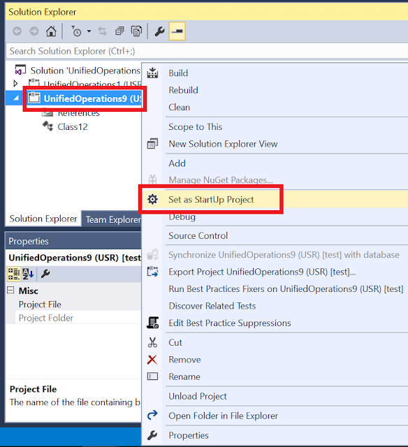
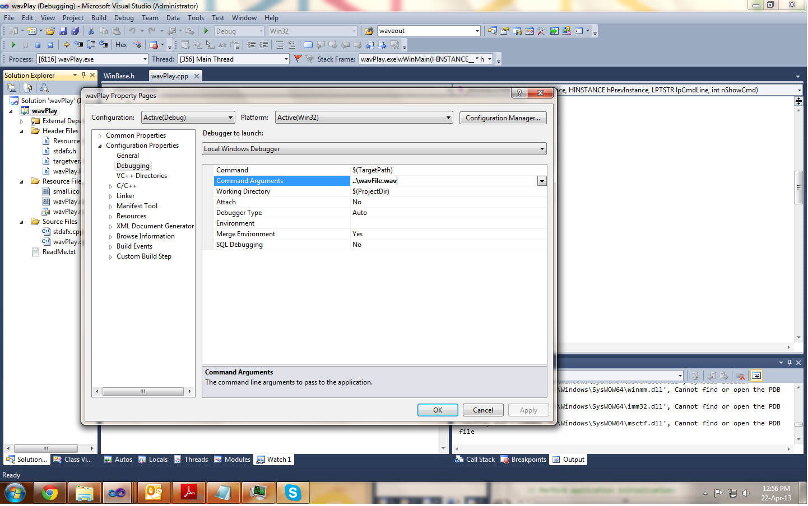

# Windows Instructions

If you are using Windows, you have two main options to compile and run the assignments:
1. Use Visual Studio (**not** Visual Studio Code)
2. Use Microsoft WSL

Option 1 requires installing Visual Studio, which is big and free only for students.
Option 2 requires installing Microsoft WSL, which is free and will allow running Linux **natively** on windows. This will allow you to follow the Unix instructions.


## Option 1

Download and install [Visual Studio](https://visualstudio.microsoft.com). Run the `cmake` form a power shell as for Unix and this should generate a file `.sln`: a Visual Studio project. If the command fails, try to use the cmake gui.


Once you open the Visual Studio project, you should see in the solution explorer several project. Right click on the one you want to run and select *Set as StartUp Project*

Finally you can press the play button to compile and run.

To pass commandline arguments, right click on the project and select *properties*. In the panel that opens select *Debugging* then fill the *Command Arguments*.



## Option 2

Open a powershell with administrative privileges and type `wsl --install` ([Microsoft Documentation](https://docs.microsoft.com/en-us/windows/wsl/install)). Wait for the process to finish and restart your machine. Upon restart, finish the linux installation by creating an username (all lowercase) and a password.

Open Visual Studio **Code** and install the [Remote Development](https://marketplace.visualstudio.com/items?itemName=ms-vscode-remote.vscode-remote-extensionpack) extension, if not present. Then click on the bottom left green corner with `><` and select new `Remote-WSL: New Window`. This will connect Visual Studio Code to the Linux subsystem. Once is open, click open folder and navigate to your code. **Note** your windows files are under `/mnt/c/Users/`. Check the [full documentation](https://code.visualstudio.com/docs/remote/wsl) in case of problem.

Once you open the folder with the code, click on the *Terminal* menu and go to the **linux** terminal. There you need to install cmake
```bash
sudo apt install cmake
```
and `g++`
```bash
sudo apt install g++
```

From here you can follow the Unix instructions, that is
```bash
mkdir build
cd build
cmake -DCMAKE_BUILD_TYPE=Debug ..
./<executable>
```

If cmake fails because of `Detecting CXX compiler ABI info` try this:

1. Create file `wsl.conf` in `/etc/` with content:
```
[automount]
options = "metadata"
enabled = true
```
2. Reboot your wsl
```
wsl.exe -t Ubuntu
```

To create the file, use
```bash
sudo nano /etc/wsl.conf
```
paste the content and type `ctrl + x` to close, on closing answer `Y` to save the file.

In case of other `cmake` failures, delete the file `CMakeCache.txt` inside the `build` folder (`rm CMakeCache.txt`) and rerun `cmake`.